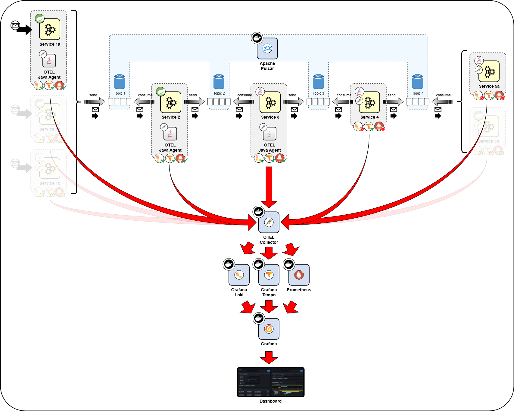

# Pulsar & OpenTelemetry

<!-- TOC -->
* [Pulsar & OpenTelemetry](#pulsar--opentelemetry)
  * [A Simple image of what I'm doing here](#a-simple-image-of-what-im-doing-here)
    * [Description](#description)
      * [Technologies](#technologies)
      * [Architecture Elements](#architecture-elements)
    * [What have I already achieved?](#what-have-i-already-achieved)
  * [Pulsar references:](#pulsar-references)
  * [OpenTelemetry references:](#opentelemetry-references)
  * [Logback references](#logback-references)
  * [Docker references](#docker-references)
  * [Next Steps:](#next-steps)
    * [Split a message into two or more. All of them must have the same trace ID](#split-a-message-into-two-or-more-all-of-them-must-have-the-same-trace-id)
    * [Keep alive applications](#keep-alive-applications)
<!-- TOC -->

## A Simple image of what I'm doing here

### Description

#### Technologies

| Icon                                                    | Name                                                                     | Description                                                                                                                                                                                                                                                                                                                                                                                                                                                                                                                                    |
|---------------------------------------------------------|--------------------------------------------------------------------------|------------------------------------------------------------------------------------------------------------------------------------------------------------------------------------------------------------------------------------------------------------------------------------------------------------------------------------------------------------------------------------------------------------------------------------------------------------------------------------------------------------------------------------------------|
|  | [Apache Pulsar](https://pulsar.apache.org/docs/4.0.x/concepts-overview/) | Distributed Messaging and Streaming tool. It is a multi-tenant, high-performance solution for server-to-server messaging. In the context of this study, is the responsible for making messages reach their destination, from service to service and it is containerized using [Docker](https://docs.docker.com/engine/) technology. For the [Java technology](https://www.java.com/en/), there is a Java client that allows creating Pulsar producers, consumers, and readers and perform administrative tasks, all thread-safe.               | 
|                | [Docker](https://docs.docker.com/engine/)                                | Docker is a software platform that helps developers package their software into containers, which include everything needed to run the application, like code, runtime, libraries, and system tools. It eases development allowing to simulate a real world multi services scenario.                                                                                                                                                                                                                                                           |
|              | [Grafana](https://grafana.com/docs/grafana/latest/introduction/)         | Grafana enables to query, visualize, alert on, and explore metrics, logs, and traces provided by a system wherever they are stored using tools to turn time-series database (TSDB) data into graphs and visualisations. In the context of this study, is the responsible for displaying logs, metrics and tracing information with dashboards accessible by the browser and it is containerized using Docker technology.                                                                                                                       |
|    | [Grafana Loki](https://grafana.com/docs/loki/)                           | A log aggregation system. It does not index the contents of the logs, only metadata about the logs’ labels. Log data itself is then compressed and stored in chunks in object stores. In the context of this study, it's containerized using Docker technology and receives the data from the OpenTelemetry Collector.                                                                                                                                                                                                                         |
|  | [Grafana Tempo](https://grafana.com/docs/tempo/)                         | A tracing backend that ingests common open source tracing protocols, including OpenTelemetry. It allows to search for traces, generate metrics from spans, and link tracing data with logs and metrics. In the context of this study, it's containerized using Docker technology and receives the data from the OpenTelemetry Collector.                                                                                                                                                                                                       |
|                    | [Java Application](https://www.java.com/en/)                             | Java applications are software programs developed using the Java programming language and running in a virtual machine. In the context of this study there are three different types of Java applications, two of them are services that communicate between each other through messages, and the third one is the OpenTelemetry [Java Agent](https://opentelemetry.io/docs/zero-code/java/agent/) that collects and export telemetry data.                                                                                                    |
|  | [OpenTelemetry](https://opentelemetry.io/docs/what-is-opentelemetry/)    | An observability framework and toolkit designed to facilitate the generation, export, and collection of telemetry data such as traces, metrics, and logs. For Java developers it is a set of observability tools that consist of the API, the SDK, and instrumentation. It includes a [Java Agent](https://opentelemetry.io/docs/zero-code/java/agent/) that allows Zero-code instrumentation with a JAR attached to any Java 8+ application. It dynamically injects bytecode to capture telemetry from many popular libraries and frameworks. |
|        | [Prometheus](https://prometheus.io/docs/introduction/overview/)          | It is a systems monitoring and alerting toolkit that collects and stores metrics as time series data                                                                                                                                                                                                                                                                                                                                                                                                                                           |
|              | Service Application                                                      | A smaller, independent application from a large ecosystem of applications that (usually) communicate with each other. Each service is responsible for a specific business function.                                                                                                                                                                                                                                                                                                                                                            |
|      | Spring Boot Powered Application                                          | TBD                                                                                                                                                                                                                                                                                                                                                                                                                                                                                                                                            |
|                  | Topic                                                                    | TBD                                                                                                                                                                                                                                                                                                                                                                                                                                                                                                                                            |

#### Architecture Elements

| #   | Image | Description |
|-----|-------|-------------|
| TBD | TBD   | TBD         |
|     |       |             |

### What have I already achieved?

- Producing a message to a pulsar topic
  - In a Spring Boot Application
  - In a simple Java Application
- Consuming the message from the pulsar topic
  - In a Spring Boot Application
  - In a simple Java Application
- Tracing using OTEL Java Agent and OTEL Collector
  - In a Spring Boot Application
  - In a simple Java Application
- Logs and Tracing sent to Grafana through Tempo and Loki

## Pulsar references:

- [Pulsar Java client](https://pulsar.apache.org/docs/next/client-libraries-java/)
  - [Set up Java client](https://pulsar.apache.org/docs/next/client-libraries-java-setup/) (dependencies)
  - [Initialize](https://pulsar.apache.org/docs/next/client-libraries-java-initialize/) (Pulsar Client & service URL)
  - [Use a Java client](https://pulsar.apache.org/docs/next/client-libraries-java-use/) (Producer, Consumer & Message Listener)
- [Spring Boot & Apache Pulsar](https://docs.spring.io/spring-pulsar/docs/1.2.4/reference/reference/pulsar/quick-tour.html) (Quick Tour)

## OpenTelemetry references:

- [Java Agent](https://opentelemetry.io/docs/zero-code/java/agent/) (Zero-code instrumentation)
  - [Annotations](https://opentelemetry.io/docs/zero-code/java/agent/annotations/) (@WithSpan, @SpanAttribute)
- [Spring Boot starter](https://opentelemetry.io/docs/zero-code/java/spring-boot-starter/)
  - [Getting started](https://opentelemetry.io/docs/zero-code/java/spring-boot-starter/getting-started/) (Maven Dependencies)
  - [Annotations](https://opentelemetry.io/docs/zero-code/java/spring-boot-starter/annotations/) (@WithSpan)
- [Collector](https://opentelemetry.io/docs/collector/)
  - [Install the Collector](https://opentelemetry.io/docs/collector/installation/) (Docker Compose)
  - [Collector Configuration](https://opentelemetry.io/docs/collector/configuration/) (not needed, use default)

## Logback references

- [Layouts](https://logback.qos.ch/manual/layouts.html) (Pattern Layout)

## Docker references

It seems to be a complete guide to put the entire ecosystem working!

- [A practical guide to implement OpenTelemetry in Spring Boot](https://vorozco.com/blog/2024/2024-11-18-A-practical-guide-spring-boot-open-telemetry.html)

## Next Steps:

### Split a message into two or more. All of them must have the same trace ID

If a consumed message must be transformed in two or more and using multithreading publish to other Pulsar topic(s), all 
messages must keep the same trace ID.

### Keep alive applications

Find a away to start and keep alive applications even though Pulsar is not available